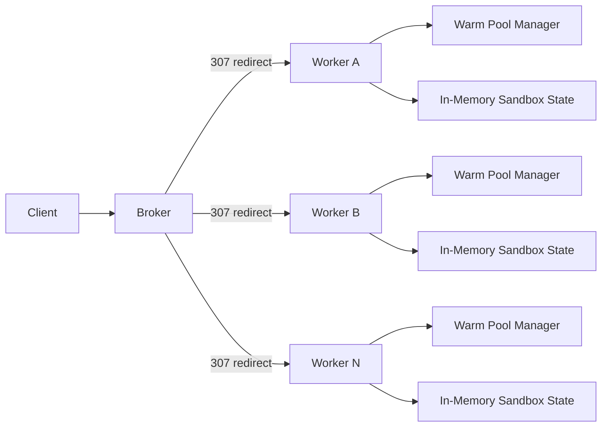
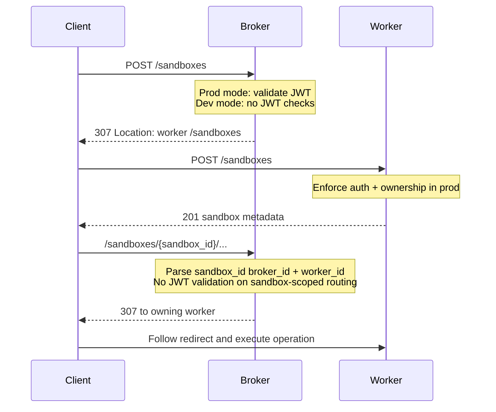
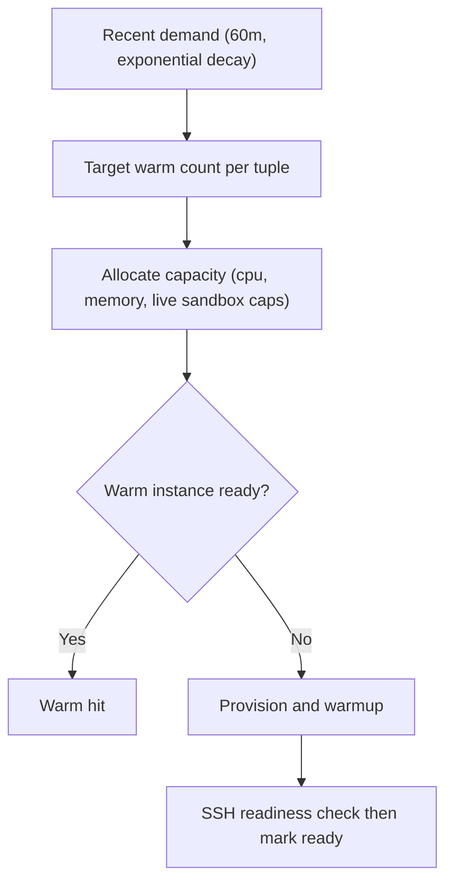

# Architecture

This document contains the technical architecture and request schematics for traforato.

## System Topology

## Request Routing

Routing behavior notes:
1. Broker is stateless for sandbox payloads; it only decides placement and redirects.
2. Sandbox-scoped worker ownership is encoded in `sandbox_id`.
3. Worker is the source of truth for sandbox state, files, execs, and lease updates.

## API Surface (v1.1 additive)
Public endpoints:
1. `POST /sandboxes`
2. `GET /sandboxes/{sandbox_id}`
3. `PATCH /sandboxes/{sandbox_id}/lease`
4. `DELETE /sandboxes/{sandbox_id}`
5. `PUT /sandboxes/{sandbox_id}/files?path=...`
6. `GET /sandboxes/{sandbox_id}/files?path=...`
7. `DELETE /sandboxes/{sandbox_id}/files?path=...`
8. `GET /sandboxes/{sandbox_id}/files/stat?path=...`
9. `GET /sandboxes/{sandbox_id}/files/list?path=...`
10. `POST /sandboxes/{sandbox_id}/files/mkdir`
11. `POST /sandboxes/{sandbox_id}/exec`
12. `POST /sandboxes/{sandbox_id}/exec/code`
13. `GET /sandboxes/{sandbox_id}/exec/{exec_id}`
14. `GET /sandboxes/{sandbox_id}/exec/{exec_id}/frames`
15. `GET /sandboxes/{sandbox_id}/exec/ws` (optional, currently not enabled)
16. `ANY /sandboxes/{sandbox_id}/proxy/{port}`
17. `ANY /sandboxes/{sandbox_id}/proxy/{port}/{path...}`
18. `GET /sandboxes/{sandbox_id}/ports/{port}/url?protocol=http|https|ws|wss`
19. `GET /metrics/sandboxes` (broker-only, unauthenticated plain-text availability snapshot)

Control-plane internal endpoints:
1. `PUT /internal/workers/{worker_id}/registration` (register or renew lease)
2. `DELETE /internal/workers/{worker_id}/registration` (best-effort deregister)
3. `POST /internal/workers/{worker_id}/vm-start` (worker asks broker for one VM start assignment)
4. `POST /internal/workers/{worker_id}/vm-events` with fields:
   `event` (`ready|claimed|retired`), `local_vm_id`, `virtualization`, `image`, `cpu`, `timestamp`.

Placement metadata:
1. `POST /sandboxes` accepts optional `hardware_sku`.
2. Broker redirects may include `local_vm_id` and `placement_retry`.

## ID Format
Sandbox IDs:
`sbx-<broker_id>-<worker_id>-<uuidv4>`

Rules:
1. `broker_id` and `worker_id` are hyphen-free component IDs.
2. Broker uses this ID to route all sandbox-scoped requests to the owning worker.

## Auth Model
| Mode | Condition | Behavior |
|---|---|---|
| `prod` | JWT secret configured | Broker validates non-sandbox entrypoints; worker validates JWT and enforces ownership. |
| `dev` | JWT secret missing | Broker and worker skip JWT checks; startup warning and auth-mode metric emitted. |

Broker unauthenticated probe/metrics endpoints:
1. `GET /healthz`
2. `GET /metrics/sandboxes` with high-level counters and per-kind `(virtualization, image, cpu)` availability.

Production JWT requirements:
1. Required claims: `client_id`, `iss`, `aud`, `exp`, `iat`, `jti`.
2. Replay protection: in-memory `jti` cache until token expiry.

Internal JWT (worker registration and VM callbacks):
1. Reuses the same secret.
2. Uses `aud=traforato-internal` and `sub=<worker_id>`.
3. Broker requires `alg=HS256`, `exp`, `iat`, and `jti`.
4. In `prod`, VM event callbacks are accepted only for workers with an active registration lease.

## Warm Pool And Capacity

Tuple key:
`(virtualization, image, cpu)`

Defaults:
1. `virtualization` defaults to `vetu`.
2. If `virtualization=tart` and `image` is omitted, `image` defaults to `ghcr.io/cirruslabs/macos-tahoe-base:latest`.
3. `max_live_sandboxes` defaults to `2` on macOS, `logical_cores_total` on Linux.
4. Memory per sandbox is derived from total memory and requested CPU.

## Telemetry And Logging
Telemetry:
1. Metrics cover utilization, latency, reliability, and `service.auth.mode`.
2. `broker.placement.retry` is expected to stay at `0`; non-zero indicates placement contention or stale ready hints.
3. Traces use W3C context propagation across broker and worker boundaries.

Logging:
1. Structured JSON logs (`slog`).
2. Request, trace, and span identifiers included.
3. Secret values are not logged.

Label policy:
1. Low-cardinality labels only.
2. High-cardinality labels such as `sandbox_id`, `exec_id`, and raw `client_id` are rejected.
