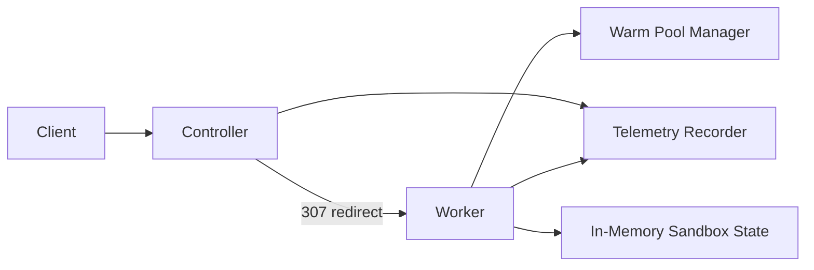
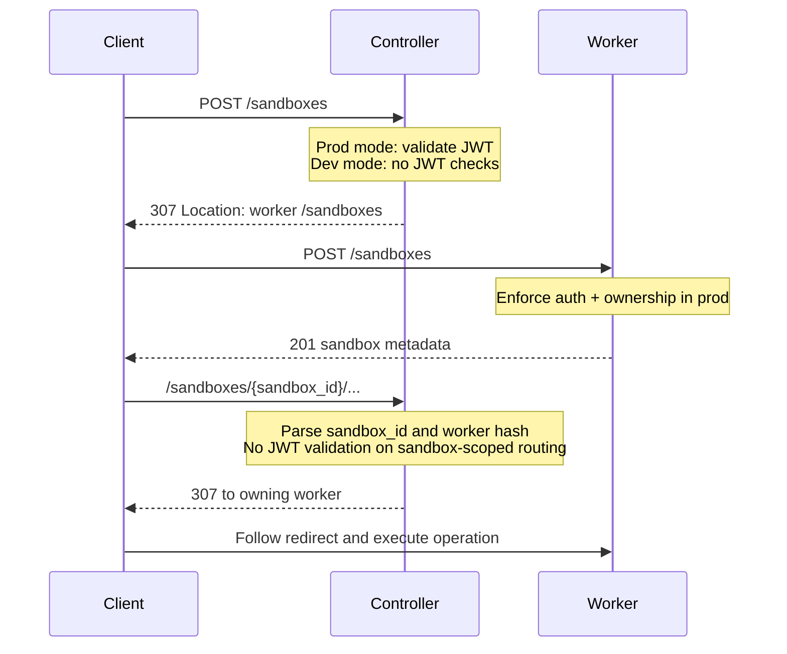
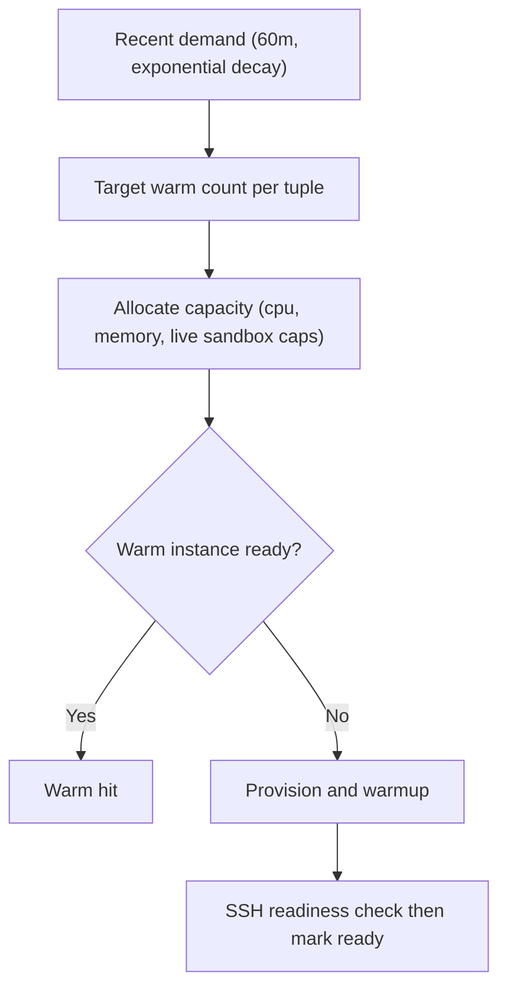

# traforetto
Prototyping sandboxes optimized for cold start.

## Overview
Traforetto is a Go prototype for routing and lifecycle management of short-lived sandboxes.
It separates control-plane routing from worker data-plane execution, with warm-pool scheduling and built-in telemetry.

Core goals:
1. Fast sandbox placement and redirect routing by `sandbox_id`.
2. Production JWT auth with ownership enforcement, plus explicit dev no-auth mode.
3. Warm pool management keyed by workload tuple `(virtualization, image, cpu)`.
4. Low-cardinality metrics, traces, and structured logs.

## Architecture

## Request Routing

## API Surface (v1)
1. `POST /sandboxes`
2. `GET /sandboxes/{sandbox_id}`
3. `PATCH /sandboxes/{sandbox_id}/lease`
4. `DELETE /sandboxes/{sandbox_id}`
5. `PUT /sandboxes/{sandbox_id}/files`
6. `POST /sandboxes/{sandbox_id}/exec`
7. `GET /sandboxes/{sandbox_id}/exec/{exec_id}`
8. `GET /sandboxes/{sandbox_id}/exec/{exec_id}/frames`
9. `GET /sandboxes/{sandbox_id}/exec/ws` (optional, currently not enabled)

`sandbox_id` format:
`sbx_<md5(lowercase(worker_hostname))>_<ulid>`

## Auth Modes
| Mode | Condition | Behavior |
|---|---|---|
| `prod` | JWT secret configured | Controller validates non-sandbox entrypoints; worker validates JWT and enforces ownership. |
| `dev` | JWT secret missing | Controller and worker skip JWT checks; startup warning and auth-mode metric emitted. |

Required JWT claims in production: `client_id`, `iss`, `aud`, `exp`, `iat`, `jti`.
Replay protection: in-memory `jti` cache until token expiry.

## Warm Pool and Capacity

Defaults:
1. `virtualization` defaults to `vetu`.
2. `max_live_sandboxes` defaults to `2` on macOS, `logical_cores_total` on Linux.
3. Memory per sandbox is derived from total memory and requested CPU.

## Telemetry and Logging
Metrics include utilization, latency, reliability, and `service.auth.mode`.
Tracing uses W3C context propagation across controller and worker boundaries.
Structured logs (`slog` JSON) include request/trace/span identifiers and avoid secrets.

Label policy is strict: only low-cardinality labels are allowed, and keys like `sandbox_id`, `exec_id`, and raw `client_id` are rejected.

## Current Scope
This is a v1 prototype with in-memory state and a single active controller model.
