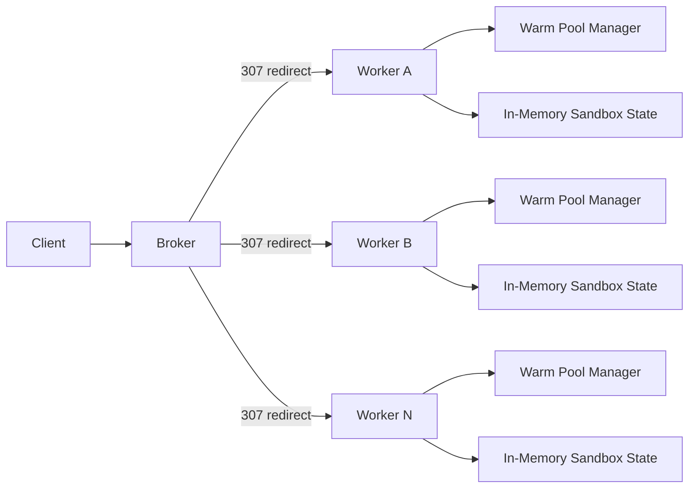
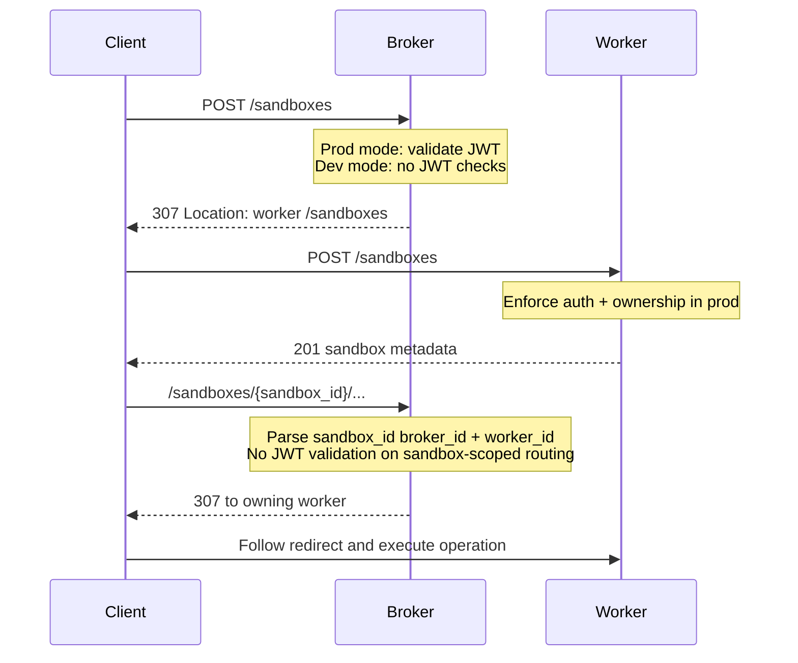
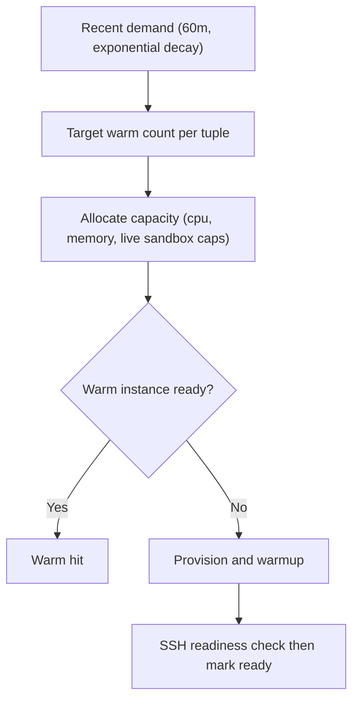

# traforato
Prototyping sandboxes optimized for cold start.

## Overview
Traforato is a Go prototype for routing and lifecycle management of short-lived sandboxes.
It separates control-plane routing from worker data-plane execution, with warm-pool scheduling and built-in telemetry.

Core goals:
1. Fast sandbox placement and redirect routing by `sandbox_id`.
2. Production JWT auth with ownership enforcement, plus explicit dev no-auth mode.
3. Warm pool management keyed by workload tuple `(virtualization, image, cpu)`.
4. Low-cardinality metrics, traces, and structured logs.

## Architecture


## Request Routing


## API Surface (v1.1 additive)
1. `POST /sandboxes`
2. `GET /sandboxes/{sandbox_id}`
3. `PATCH /sandboxes/{sandbox_id}/lease`
4. `DELETE /sandboxes/{sandbox_id}`
5. `PUT /sandboxes/{sandbox_id}/files?path=...`
6. `GET /sandboxes/{sandbox_id}/files?path=...`
7. `DELETE /sandboxes/{sandbox_id}/files?path=...`
8. `GET /sandboxes/{sandbox_id}/files/stat?path=...`
9. `GET /sandboxes/{sandbox_id}/files/list?path=...`
10. `POST /sandboxes/{sandbox_id}/files/mkdir`
11. `POST /sandboxes/{sandbox_id}/exec`
12. `POST /sandboxes/{sandbox_id}/exec/code`
13. `GET /sandboxes/{sandbox_id}/exec/{exec_id}`
14. `GET /sandboxes/{sandbox_id}/exec/{exec_id}/frames`
15. `GET /sandboxes/{sandbox_id}/exec/ws` (optional, currently not enabled)
16. `ANY /sandboxes/{sandbox_id}/proxy/{port}`
17. `ANY /sandboxes/{sandbox_id}/proxy/{port}/{path...}`
18. `GET /sandboxes/{sandbox_id}/ports/{port}/url?protocol=http|https|ws|wss`

`POST /sandboxes` accepts optional `hardware_sku` to target placement to workers with that SKU.

`sandbox_id` format:
`sbx-<broker_id>-<worker_id>-<uuidv4>`
(`broker_id` and `worker_id` are hyphen-free component IDs)

## Auth Modes
| Mode | Condition | Behavior |
|---|---|---|
| `prod` | JWT secret configured | Broker validates non-sandbox entrypoints; worker validates JWT and enforces ownership. |
| `dev` | JWT secret missing | Broker and worker skip JWT checks; startup warning and auth-mode metric emitted. |

Required JWT claims in production: `client_id`, `iss`, `aud`, `exp`, `iat`, `jti`.
Replay protection: in-memory `jti` cache until token expiry.

## Warm Pool and Capacity


Defaults:
1. `virtualization` defaults to `vetu`.
2. `max_live_sandboxes` defaults to `2` on macOS, `logical_cores_total` on Linux.
3. Memory per sandbox is derived from total memory and requested CPU.

## Telemetry and Logging
Metrics include utilization, latency, reliability, and `service.auth.mode`.
Tracing uses W3C context propagation across broker and worker boundaries.
Structured logs (`slog` JSON) include request/trace/span identifiers and avoid secrets.

Label policy is strict: only low-cardinality labels are allowed, and keys like `sandbox_id`, `exec_id`, and raw `client_id` are rejected.

## Running Services
Start a worker:

```bash
go run ./cmd/worker
```

Or with a YAML config file:

```bash
go run ./cmd/worker --file ./worker.yaml
```

Example `worker.yaml`:

```yaml
broker-id: broker_local
worker-id: worker_local
hostname: localhost
hardware-sku: cpu-standard
virtualization: vetu

total-cores: 8
total-memory-mib: 16384
max-live-sandboxes: 6
default-ttl: 30m

log:
  level: info
  file: /var/log/traforato/worker.log
  rotate-size: 100 MB
  max-rotations: 10

pre-pull:
  images:
    - ghcr.io/cirruslabs/ubuntu-runner-amd64:24.04
    - alpine:3.20
```

YAML parsing is strict (unknown keys fail fast). For overlapping values, the YAML file overrides flag and environment defaults.

Start a broker (defaults to one worker at `http://localhost:8081`):

```bash
go run ./cmd/broker
```

Optional static worker registration fields on broker include `--worker-hardware-sku` (or `TRAFORATO_BROKER_WORKER_HARDWARE_SKU`).
Broker identity can be configured with `--broker-id` (or `TRAFORATO_BROKER_ID`).

Start both broker and worker for local development:

```bash
go run ./cmd/dev
```

`cmd/dev` also accepts the same worker config file via `--file` (or `TRAFORATO_DEV_WORKER_CONFIG`) and applies it to worker runtime settings, logging, hardware SKU registration, and pre-pull images.
Worker and dev commands support broker identity via `--broker-id` (`TRAFORATO_WORKER_BROKER_ID` / `TRAFORATO_DEV_BROKER_ID`).

By default, all commands run in `dev` no-auth mode (empty `TRAFORATO_JWT_SECRET`).
Set `TRAFORATO_JWT_SECRET` (and optionally `TRAFORATO_JWT_ISSUER`, `TRAFORATO_JWT_AUDIENCE`) to enable `prod` JWT validation mode.

## Releases
Tagging a commit as `vX.Y.Z` triggers the release workflow:
1. Goreleaser publishes cross-platform binaries for:
   - `traforato-broker`
   - `traforato-worker`
2. Docker Buildx publishes a multi-arch image to GHCR for:
   - `ghcr.io/<owner>/<repo>:vX.Y.Z`
   - `ghcr.io/<owner>/<repo>:latest`

On pull requests and non-tag pushes to `main`, the same workflow runs in dry-run mode:
1. Goreleaser snapshot build (`--snapshot --skip=publish`).
2. Docker multi-arch build without pushing.

Run the released container:

```bash
docker run --rm -p 8080:8080 ghcr.io/<owner>/<repo>:latest
```

## Current Scope
This is a v1 prototype with in-memory state and a single active broker model.
